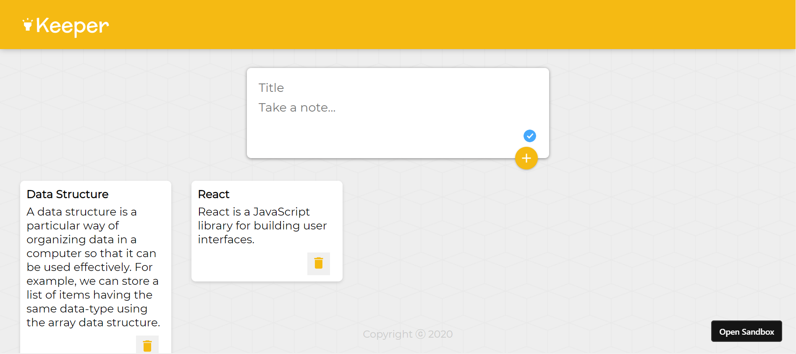

# Keeper-App

Keeper App is used to save your notes for future reference. Developed using React Frontend Interface.

Screenshot of Keeper App

🏃‍♂️ Local Installation

1. Install the Node Modules:
npm install
2. At last, push in the command which will kickstart the application on Local Host:
npm start
